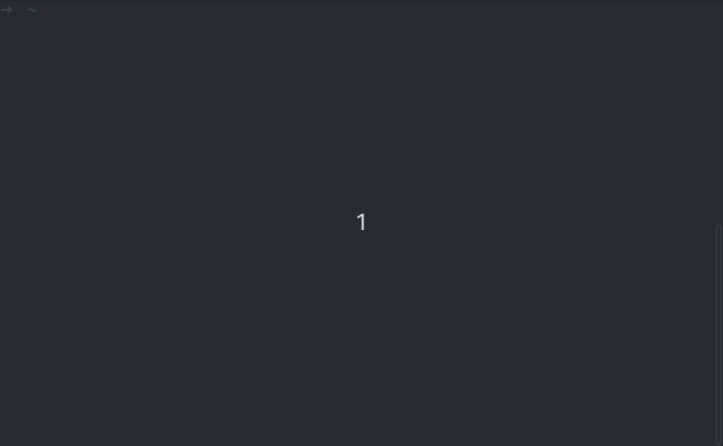

# RMatrix
> The matrix in Rust.

[](https://travis-ci.org/magmast/rmatrix)

Matrix like animation running in terminal.



## Installation

You can install rmatrix via Cargo with just one command:

```sh
cargo install rmatrix
```

## Usage

When you feel that you need to see random characters on your screen just run:

```sh
rmatrix
```

## License
This project is licensed under the MIT License - see the LICENSE.md file for details